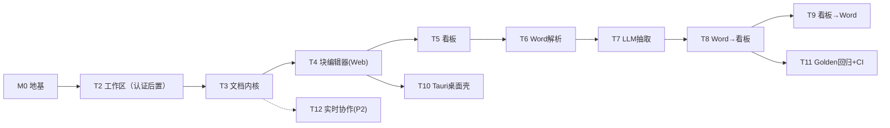

# TransNote 开发路线

> 本文档是 TransNote 的开发路线（Roadmap），与《类Notion平台_MVP开发交接文档.md》配套：任务粒度与验收标准以交接文档为准，本文档负责**顺序、依赖、里程碑与并行策略**。
> 版本：v1.0（2026-09-06）｜技术栈定版：Java 25 + Spring Boot 4.1.1 + Gradle + bun workspaces + lefthook/commitlint

---

## 1. 路线总览（一句话）

**先打通「文档 + 看板 + AI 双向转换」的 MVP 闭环，再上实时协作与多端**；MVP 主线唯一，不并行铺多端。

## 2. 里程碑总览

| Phase | 里程碑 | 目标 | 任务（交接文档 §11） | 验收标准（DoD 摘要） | 预计 |
|---|---|---|---|---|---|
| **P0 地基** | M0.1 | 仓库就绪 | 项目改名 TransNote、git init、首次提交 | `chore(repo)` 提交落地，check.sh 全绿 | 3~5 天 |
| | M0.2 | 提交规范落地 | commitlint + lefthook 配置并实测 | 坏提交被拦截；`bunx commitlint` 通过规范样例 | |
| | M0.3 | 后端环境 | Java 25 默认（sdkman）、Gradle wrapper、空 Spring Boot 4.1.1 项目 | `./gradlew bootRun` 起服务、`/actuator/health` 或自建 health 200 | |
| | M0.4 | 依赖环境 | bun workspaces 骨架 + infra/docker-compose | PG/Redis/MinIO 一键起；根 `package.json` 声明 workspaces | |
| **P1 MVP** | M1 | 工作区与文档内核（认证后置，ADR-11） | T2 工作区 + T3 | 可建工作区；blocks 表与块 CRUD 可用 | 6~8 周 |
| | M2 | 文档内核 | T3 document + blocks 表 | 块树 CRUD 正确；JSONB 存储；version 递增 | |
| | M3 | 块编辑器 | T4 core + web | 段落/标题/todo/列表/引用/代码块可编辑；拖拽排序；刷新不丢 | |
| | M4 | 看板 | T5 board | 建列/卡片；拖拽换列/排序一次提交；筛选生效 | |
| | M5 | **AI 转换（核心）** | T6→T7→T8→T9 | 见 §3 详细验收；Golden 回归 + 置信度门 + 双向追溯 | |
| | M6 | 桌面壳 + CI | T10、T11 | Tauri 可登录编辑、导出 .docx 到本地；CI 跑 Golden 回归 | |
| **P2 协作** | M7 | 实时协作 | T12 collab | 两人同开文档：A 编辑 B 可见；快照可恢复（先全量后增量） | 4~6 周 |
| | M8 | 全文检索 | search（ES） | 文档/看板/卡片可搜 | |
| | M9 | 体验完善 | 版本历史 UI、回收站、桌面离线 | 桌面断网可编辑，重连 CRDT 合并 | |
| **P3 移动** | M10 | Flutter 移动端 | mobile（Windows worktree 开发） | 查看/轻编辑/待办勾选/推送/离线队列 | 8 周+ |
| | M11 | 转换质量迭代 | Golden 扩充、few-shot 回流、多 provider | 准确率持续达标（title 95% / assignee 90% / due 90%） | |
| | M12 | 性能/国际化/发布 | 虚拟滚动、i18n、打包发布 | 长文档不卡；三端可分发 | |

## 3. M5（AI 转换）详细拆解与验收

| 步骤 | 内容 | 验收 |
|---|---|---|
| T6 | POI 解析 .docx → DocElement 树（heading/表格/勾选/列表）+ 分块（≤2k token） | 20+ 样例解析正确；老格式报错友好 |
| T7 | `LlmProvider` 抽象 + JSON Schema 抽取（task_title/assignee/due_date/priority/evidence/confidence） | 输出合规；evidence 非空；prompt_version 记录 |
| T8 | Word→看板：规则优先 + LLM + 置信度门（<0.8 人工校对）→ 建列/卡片 + 来源追溯 | 高置信自动入库；低置信强制 REVIEW；卡片可跳回原文段落 |
| T9 | 看板→Word：数据聚合 → 模板渲染（POI XWPF）→ PDF 校验 → MinIO 产物 | .docx 可打开；标题层级/表格/☐☑ 正确 |

**M5 完成判据（MVP 核心闭环）**：Web 上完成「建文档 → 写块 → 建看板 → 拖卡片 → 上传 .docx 自动变看板 → 看板导出 .docx」，全程每步可验证、可追溯。

## 4. 依赖关系与并行策略

- **关键路径**：M0 → T2 → T3 → T4 → T5 → T6 → T7 → T8（MVP 主线，串行不可跳过）
- **可并行**：T5 前端与 T4 可并行（board 模块 vs 编辑器组件）；T9 可与 T8 校对 UI 并行；T10/T11 在 T4/T8 之后可并行
- **多 Agent 分工建议**（遵守 .agents 文件所有权）：BackendAgent 走 T2/T3/T5/T6~T9 后端；FrontendAgent 走 T4/T5 前端 + core 包；LlmAgent 盯 T7/T8 质量与 Golden 集；QaAgent 在每个里程碑结束时做验收

## 5. 前置条件与风险

| 前置/风险 | 说明 | 对策 |
|---|---|---|
| Java 25 环境 | sdkman 当前默认需切到 25（`sdk default java 25.0.4-graal`），设 JAVA_HOME | P0.3 最先做，卡住一切后端开发 |
| Spring Boot 4 生态细节 | `spring-boot-starter-webmvc`（非 starter-web）；springdoc 与 Boot 4 的兼容版本 | M0.3 建空项目时验证；不兼容则记录并换方案 |
| LLM API Key | T7 前置 | 提供 OpenAI 兼容端点（DeepSeek/通义/豆包），配置走环境变量 |
| bun 不在默认 PATH | 钩子/命令需 `export PATH="$HOME/.bun/bin:$PATH"` | 已写入 lefthook 约定 |
| Flutter 工具链 | 在 Windows 侧（D:\programmer\flutter），WSL 不装 | Phase 3 用 git worktree 在 Windows 检出 mobile 分支开发 |
| 范围蔓延 | 表格数据库视图/模板市场等不做（vision.md 边界） | 每个里程碑对照 vision.md 审查 |

## 6. 建议的首次冲刺（接下来 2 周）

| 周 | 目标 | 产出 |
|---|---|---|
| 第 1 周 | P0 全部（M0.1~M0.4） | 仓库可提交、坏提交被拦截、后端空服务跑通、依赖环境就绪 |
| 第 2 周 | T2（工作区）+ T3（文档内核）开始 | 能建工作区；blocks 表与块 CRUD API 可用 |

> 首次冲刺完成即满足「能注册登录、能建文档写块」的第一版可用雏形。

## 7. 收尾规则

- 每个里程碑完成 = 功能可用 + 测试绿 + `bash .agents/tools/check.sh` 全绿 + docs/AGENTS.md 同步 + `.agents/history/` 当日日志更新
- 路线变更（增删里程碑/改顺序）须更新本文件 + MEMORY.md，并经用户拍板
