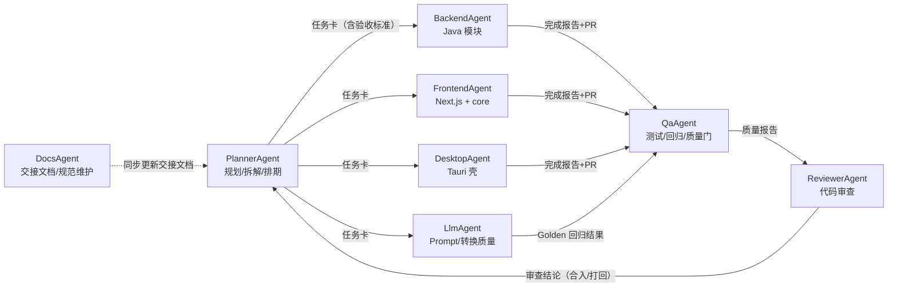

# 类 Notion 平台 · AI Agent 开发规范

> **用途**：规范参与本项目的各类 AI Agent 的角色职责、开发纪律、交接协议与质量门，使多个 Agent 可并行/接力开发同一代码库而不互相踩踏、不丢失上下文。
>
> **配套文档**：《类Notion平台_MVP开发交接文档.md》（技术上下文与任务清单，本文档的规范对象）
>
> **版本**：v1.0（2026-09-06）

---

## 1. 适用范围与总原则

**适用**：所有参与本仓库开发的 AI Agent（无论由谁编排），以及人工开发者（作为 Agent 的上游/下游）。

**五条总原则**（违反任一即视为未遵守本规范）：

1. **先读上下文再动手**：接任务前必须读取《MVP开发交接文档》相关章节 + 仓库 `AGENTS.md` + 目标模块已有代码；禁止凭印象直接写。
2. **只改任务点名的范围**：不顺手重构、不重命名无关符号、不修改他模块文件（见 §6 文件所有权）。
3. **可验证才算完成**：每个任务按 DoD 验证（§7），完成报告必须给出可复现的验证命令与结果。
4. **事实不编造**：版本号、依赖坐标、API 字段、测试数据必须来自真实环境验证；写不出来的功能如实说明，不静默降级。
5. **交接留痕**：完成即写完成报告（§5.2），上下文以文档/任务卡传递，不依赖"上一轮记忆"。

## 2. 角色地图



**固定分工原则**：`PlannerAgent` 永远是任务派发唯一入口；`ReviewerAgent` 是合入唯一出口；`QaAgent` 对每个 PR 有一票否决权。其他 Agent 之间不直接合入对方代码。

## 3. 各角色职责与规范

### 3.1 PlannerAgent（规划/架构）

| 项 | 内容 |
|---|---|
| 职责 | 把需求拆成可执行任务卡；维护任务依赖与排期；裁决 ADR 变更；分配文件所有权 |
| 输入 | 需求描述、用户反馈、Reviewer 打回意见 |
| 输出 | 任务卡（§5.1 模板）、更新后的《MVP开发交接文档》、ADR 决策 |
| 必须遵守 | 每个任务卡必须包含：目标、影响模块/文件、验收标准（可测）、依赖、预估涉及的技术点 |
| 禁止 | 不写实现代码；不把"调研"当"决策"（决策必须落成 ADR 文字） |
| 交接物 | 任务卡列表 + 交接文档最新版 |

### 3.2 BackendAgent（Java 后端）

| 项 | 内容 |
|---|---|
| 职责 | identity/document/board/conversion/collab 等 Java 模块的开发与单测 |
| 输入 | 任务卡 + 交接文档 §7/§8 + 模块现有代码 |
| 输出 | 可运行代码 + JUnit5 单测 + 集成测试 + 完成报告 |
| 必须遵守 | 包结构 §7.1；跨模块只走 `api/` 接口；SQL 参数化；异常统一处理；接口返回统一 `{code,data,message}`；关键业务写集成测试 |
| 禁止 | 直接改他模块 repository；绕过 DTO 直接暴露实体；硬编码 LLM 供应商；把密钥写进代码/配置提交 |
| 交接物 | PR + 完成报告（含本地验证命令与结果、新增 API 清单） |

### 3.3 FrontendAgent（Web + core 包）

| 项 | 内容 |
|---|---|
| 职责 | Next.js 应用、`packages/core` 编辑器/看板组件、`api-client` 封装 |
| 输入 | 任务卡 + 交接文档 §9 + OpenAPI 契约 |
| 输出 | 组件代码 + Vitest 单测 + 完成报告 |
| 必须遵守 | core 包不依赖 Next.js；组件 `'use client'` 边界清晰；API 只走 api-client；类型来自生成契约（strict，禁 `any`）；乐观更新带回滚 |
| 禁止 | 在组件里直接 fetch；给 core 引入 Next 专有 API；不经契约手写类型 |
| 交接物 | PR + 完成报告（含本地 `pnpm dev` 验证结果、UI 交互点说明） |

### 3.4 DesktopAgent（Tauri 壳）

| 项 | 内容 |
|---|---|
| 职责 | Tauri 2 应用壳：复用 core、Rust 命令（文件保存/托盘/对话框）、capabilities 配置 |
| 输入 | 任务卡 + 交接文档 §9.3 + Web 端可运行代码 |
| 输出 | desktop 应用 + Rust 单测（如有）+ 完成报告 |
| 必须遵守 | capabilities 最小授权（只开任务所需权限）；Rust 命令返回 `Result<T, String>`；三平台 WebView 差异写进冒烟清单 |
| 禁止 | 给 Rust 命令开宽松权限；桌面功能绕过后端 API 直连数据库 |
| 交接物 | PR + 完成报告（注明在哪个平台验证过） |

### 3.5 MobileAgent（Flutter，Phase 3）

| 项 | 内容 |
|---|---|
| 职责 | Flutter 应用：查看/轻编辑/离线队列/推送 |
| 输入 | 任务卡 + OpenAPI 契约（Dart 生成 client）+ 交接文档 §10 |
| 输出 | Flutter 代码 + widget/单元测试 + 完成报告 |
| 必须遵守 | 离线优先：Drift 本地库 + 同步队列；UI 不阻塞主线程；弱网退避 |
| 禁止 | 不经 OpenAPI 手写 Dart 模型；本地缓存明文存敏感数据 |
| 交接物 | PR + 完成报告（含真机/模拟器验证） |

### 3.6 LlmAgent（Prompt 工程 / 转换质量）

| 项 | 内容 |
|---|---|
| 职责 | Prompt 模板维护、抽取 JSON Schema 治理、Golden 回归集维护、质量指标监控 |
| 输入 | 任务卡 + 交接文档 §8 + 真实失败样本（校对回流） |
| 输出 | 更新后的 prompt 文件 + golden 用例 + 质量报告（准确率对比） |
| 必须遵守 | prompt_version 随模板变更递增；每次变更必须跑 Golden 回归；输出 Schema 字段冻结（增字段需 Planner 批准） |
| 禁止 | 不回滚验证就上线新 prompt；把用户校对数据直接塞进公开提示词（隐私风险） |
| 交接物 | PR + 质量对比报告（旧 vs 新 prompt 的准确率） |

### 3.7 QaAgent（测试 / 质量门）

| 项 | 内容 |
|---|---|
| 职责 | 编写/执行测试计划；跑 Golden 回归；检查 DoD；对 PR 行使一票否决 |
| 输入 | PR + 完成报告 + 交接文档验收标准 |
| 输出 | 测试报告（覆盖清单、结果、反证） |
| 必须遵守 | 按任务卡验收标准逐项验证（不只是跑通冒烟）；主动找反例（边界、权限越权、空输入、并发）；移动端/桌面端按平台冒烟 |
| 禁止 | 用"代码能编译"代替"功能正确"；复述完成报告而不独立验证 |
| 交接物 | 质量门结论（通过/打回 + 原因） |

### 3.8 ReviewerAgent（代码审查）

| 项 | 内容 |
|---|---|
| 职责 | 审查 PR：架构符合 ADR、安全红线、性能风险、规范遵守 |
| 输入 | PR diff + QaAgent 质量报告 + 交接文档 |
| 输出 | 审查结论：approve / request-changes（附逐条意见） |
| 必须遵守 | 只审不写；意见必须给出依据（对应规范条款或 ADR）；安全红线一票否决 |
| 禁止 | 放行未跑 CI 的 PR；对红线问题使用"建议后续优化"措辞 |
| 交接物 | 审查结论（回给 PlannerAgent 裁决） |

### 3.9 DocsAgent（文档维护）

| 项 | 内容 |
|---|---|
| 职责 | 维护《MVP开发交接文档》《AI-Agent开发规范》、`AGENTS.md`、README、API 文档 |
| 输入 | 各 Agent 完成报告、ADR 变更、用户要求 |
| 输出 | 更新后的文档（diff 说明） |
| 必须遵守 | 文档与代码同步为 DoD 前提；只记录事实（含验证命令），不写未经验证的能力声明 |
| 禁止 | 编造版本号/功能描述；把废弃决策留在文档里不标注 |
| 交接物 | 文档更新 PR + 变更摘要 |

## 4. 通用开发规范（所有 Agent 必须遵守）

### 4.1 分支与提交

- 分支：`feat/{module}-{taskId}`（如 `feat/conversion-t8`）；禁止直接提交 main。
- 提交：Conventional Commits，scope 用模块名：`feat(board): support card drag reorder`。
- 一个 PR = 一个任务卡；PR 描述贴任务卡编号与验收标准。

### 4.2 代码风格

- Java：包 `com.transnote.*`，分层 controller/service/repository；controller 薄；DTO/实体分离；SLF4J 日志。
- TS：strict；类型来自生成契约；禁 `any`（确需时注释）。
- Dart：flutter_lints 默认规则。
- 命名：领域词统一（见交接文档数据模型），禁止同一概念多套叫法（如 task/card/todo 混用）。

### 4.3 测试规范

- 新增业务逻辑必须有单测；关键链路（认证/块 CRUD/看板拖拽/转换主链路）有集成测试。
- Golden 回归：LLM 相关变更必须跑；准确率低于阈值视为失败。
- 前端核心逻辑 Vitest；E2E 主链路 Playwright（登录→建文档→建看板→转换→导出）。

### 4.4 安全红线（一票否决）

- SQL 参数化；禁止拼接。
- 文件上传白名单（.doc/.docx/.pdf）且 ≤ 20MB；下载用签名 URL。
- 密钥/Token/连接串禁止入库（`git secrets` 扫描）；环境变量只经 `.env.example` 说明。
- 越权：所有数据访问必须过 `workspace_id` 校验。
- 不把用户校对数据/文档内容写进日志或提示词样例（隐私）。

### 4.5 上下文传递规则

- 任务卡、完成报告、质量报告是**唯一**跨 Agent 上下文载体；不依赖对话记忆。
- 所有路径写绝对路径或相对仓库根的相对路径；命令必须可复制执行。
- 交接文档任何章节变更 = DocsAgent 同步更新，否则 Reviewer 打回。

## 5. 交接协议

### 5.1 任务卡模板（Planner → 开发 Agent）

```markdown
## 任务卡 T{编号}
- 标题：{一句话}
- 目标：{用户/业务价值}
- 影响模块/文件：{模块} → {文件列表（尽量精确）}
- 技术要点：{涉及 ADR/接口/数据模型，引用交接文档章节}
- 依赖任务：T{编号}（无则写"无"）
- 验收标准（DoD）：
  1. {可测行为 1}
  2. {可测行为 2}
- 禁止事项：{该任务特别禁止的（如"不得改动 blocks 表结构"）}
```

### 5.2 完成报告模板（开发 Agent → QA/Reviewer）

```markdown
## 完成报告 · 任务卡 T{编号}
- 变更文件：{列表 + 一行说明}
- 实现摘要：{3~5 句，含关键决策}
- 验证方式与结果：
  - 命令：`{可复现命令}` → 结果：{输出/截图/通过}
  - 单测/集成测试：{n} 通过 / {m} 失败
- 未完成/降级项：{如实说明，禁止省略}
- 影响说明：{是否改 API/数据模型/ADR；是否需要 DocsAgent 同步}
```

### 5.3 质量报告模板（QA → Reviewer）

```markdown
## 质量报告 · PR #{编号}
- 逐项验收结果：{任务卡验收标准 → 通过/不通过 + 证据}
- 反例探测：{越权/空输入/并发/边界 探测结果}
- Golden 回归（如涉及）：{通过率 vs 阈值}
- 结论：✅ 放行 / ❌ 打回（原因列表）
```

## 6. 并行协作规则（文件所有权）

同一时刻**只有一个 Agent** 可写下列每个单元；跨单元并行安全：

| 单元（目录/文件） | 所有者 Agent | 他人行为 |
|---|---|---|
| `server/modules/{module}/**` | BackendAgent（单模块单 Agent） | 只读 |
| `packages/core/**`、`apps/web/**` | FrontendAgent | 只读 |
| `apps/desktop/**`、`src-tauri/**` | DesktopAgent | 只读 |
| `mobile/**` | MobileAgent | 只读 |
| `server/modules/conversion/src/main/resources/prompts/**`、golden 集 | LlmAgent | 只读 |
| `*.md`（交接/规范/README）、`AGENTS.md` | DocsAgent | 只读 |
| `infra/**`、CI 配置 | PlannerAgent 裁决后由对应 Agent 改 | 先申报 |

**冲突规则**：需要改他人所有权文件时，先经 PlannerAgent 在任务卡中显式授权（写清"本次可改 X 文件"），否则禁止；改完立即在完成报告中声明，DocsAgent 同步文档。

## 7. 质量门与合入检查（PR 合入前逐项核对）

- [ ] CI 全绿（lint + 单测 + 集成测试 + 构建）
- [ ] QaAgent 逐项验收通过，反例探测无未决问题
- [ ] ReviewerAgent approve（安全红线零遗留）
- [ ] 完成报告已提交且无未声明降级项
- [ ] 若改动 API/数据模型/ADR → DocsAgent 已同步交接文档
- [ ] `git secrets` 扫描通过，无密钥入库
- [ ] 与任务卡验收标准逐条对应

**打回即重开**：任一质量门不通过，任务卡回到原开发 Agent 重做，PlannerAgent 更新排期；不允许"带病合入，后续再修"。

## 8. 变更管理

- ADR / 数据模型 / API 契约变更：由发起 Agent 提变更说明 → PlannerAgent 裁决 → DocsAgent 更新交接文档 → 才允许动代码。
- 本文档（Agent 规范）本身变更：由 PlannerAgent + ReviewerAgent 双确认后由 DocsAgent 落地。
- 版本记录：每次修订在文末追加一行 `v{日期} · {变更摘要} · {作者 Agent}`。
