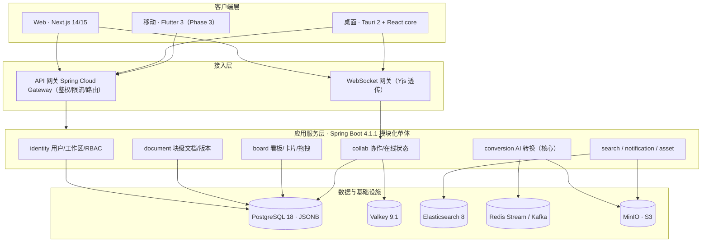

# 类 Notion 协作平台 · MVP 开发交接文档

> **本文档用途**：给接手开发的 AI Agent / 开发者提供完整上下文，按本文档可直接开始编码，无需再向原设计者追问。
>
> **版本**：v1.0（2026-09-06）｜**配套文档**：《类Notion平台_AI-Agent开发规范.md》（角色分工与交接协议）

---

## 1. 项目概述

块级文档协作平台（类 Notion）+ **AI 驱动的 Word ↔ 待办看板双向转换**，覆盖 Web / 桌面 / iOS / Android。

核心差异化能力：

| 能力 | 说明 |
|---|---|
| Word → 待办看板 | 解析 .docx → LLM 结构化抽取 → 生成看板列/卡片（负责人/截止/优先级），保留与原文的逐条追溯 |
| 待办看板 → Word | 看板数据聚合 → 模板渲染（可选 LLM 组织正文）→ 导出排版良好的 .docx |

## 2. 交接快照（TL;DR）

- **后端**：Java 25 + Spring Boot 4.1.1，**模块化单体**（Spring Modulith），PostgreSQL 18（blocks 用 JSONB）
- **Web**：Next.js 14/15（App Router）+ React + TypeScript
- **桌面**：Tauri 2（Rust 壳）复用 Web 的 React core，补本地文件/离线/托盘能力
- **移动**：Flutter 3（Phase 3 再做，本交接仅预留 API 与同步契约）
- **实时协作**：Yjs (CRDT)，服务端**透传 + 快照存储**方案（详见 §7.5）
- **AI 转换**：异步任务模式，规则优先 + LLM 结构化抽取 + 人工校对门
- **仓库**：pnpm monorepo（apps/web + apps/desktop + packages/core + server + mobile + infra）

## 3. 架构决策记录（ADR）

| 编号 | 决策 | 理由 |
|---|---|---|
| ADR-1 | 模块化单体，不直接上微服务 | 团队 <10 人，避免分布式事务/链路/部署成本；热点模块可后拆 |
| ADR-2 | 实时协作选 Yjs (CRDT)，不造 OT | CRDT 天然支持离线合并，实现成本低 |
| ADR-3 | 服务端不解析 Yjs 内部结构，只透传 + 存二进制快照 | Java 生态无成熟 Yjs 实现；快照由客户端编码，服务端当 blob 存 |
| ADR-4 | AI 转换走异步任务（HTTP 立即返回 jobId） | LLM 耗时 10~60s，不能阻塞 HTTP 链路 |
| ADR-5 | 规则优先（正则），LLM 只做语义抽取 | 省 token、快、可测；LLM 输出必须带证据引用与置信度 |
| ADR-6 | 消息用 Redis Stream 起步，量起来换 Kafka | 团队对 Kafka 运维成本高，MVP 用 Stream 够用（接口抽象隔离） |
| ADR-7 | Web/桌面共享 core 包（Monorepo），移动端独立 UI 但共享 API 契约 | 桌面复用 React 代码，跨框架复用收益低 |

## 4. 仓库结构与开发环境

### 4.1 仓库结构

```text
monorepo/
├── apps/
│   ├── web/                  # Next.js
│   └── desktop/              # Tauri 2.x（引用 packages/core）
├── packages/
│   ├── core/                 # React 编辑器/看板组件、hooks、Zustand stores
│   ├── api-client/           # OpenAPI 生成 + fetch/WS 封装（TS）
│   ├── schema/               # Block JSON Schema（双端代码生成源头）
│   └── ui/                   # 设计系统组件
├── mobile/                   # Flutter（Phase 3）
├── server/                   # Java 模块化单体
│   ├── app/                  # 启动器 + 网关配置
│   └── modules/              # identity/document/board/collab/conversion/search/notification/asset
└── infra/                    # docker-compose.yml、CI 脚本、k8s manifests
```

### 4.2 本地开发环境（Docker Compose）

`infra/docker-compose.yml` 一键起依赖：

```yaml
services:
  postgres:
    image: postgres:18
    environment: { POSTGRES_DB: transnote, POSTGRES_USER: dev, POSTGRES_PASSWORD: dev }
    ports: ["5433:5432"]   # 宿主 5432 被本机其他项目占用，transnote 用 5433
    volumes: [pgdata:/var/lib/postgresql/data]
  valkey:
    image: valkey/valkey:9.1.2   # Redis 协议兼容，替代 redis:7
    ports: ["6379:6379"]
  minio:
    image: minio/minio:latest
    command: server /data --console-address ":9001"
    ports: ["9000:9000", "9001:9001"]
    environment: { MINIO_ROOT_USER: dev, MINIO_ROOT_PASSWORD: devdevdev }
  elasticsearch:
    image: docker.elastic.co/elasticsearch/elasticsearch:9.5.3   # 后置依赖，默认不启用
    environment: [ "discovery.type=single-node", "xpack.security.enabled=false" ]
    ports: ["9200:9200"]
```

### 4.3 环境变量约定（server）

| 变量 | 默认 | 说明 |
|---|---|---|
| `DB_URL` / `DB_USER` / `DB_PASS` | `jdbc:postgresql://localhost:5433/transnote` / dev / dev | PostgreSQL 18（宿主 5433，5432 被占用） |
| `REDIS_URL` | `redis://localhost:6379` | Valkey 9.1.2（协议兼容，连接串 scheme 仍为 redis://） |
| `MINIO_ENDPOINT` / `MINIO_BUCKET` | `http://localhost:9000` / `assets` | 对象存储 |
| `LLM_BASE_URL` / `LLM_API_KEY` / `LLM_MODEL` | 空（必填） | OpenAI 兼容接口，可指向 DeepSeek/通义/豆包等 |
| `JWT_SECRET` | 空（必填，≥32 字符） | HS256 密钥 |

## 5. 总体架构



## 6. MVP 范围

| 做（MVP 内） | 不做（后置） |
|---|---|
| 工作区（公司内网暂免登录，认证后置） | 认证（邮箱/手机号 + JWT）、RBAC、第三方登录、SSO |
| 块级编辑器：paragraph/heading/todo/列表/引用/分隔线/代码块 | 表格/图片/数据库视图/评论/模板市场 |
| 文档 CRUD + 版本历史（按块 version） | 全文检索（Phase 2）、回收站深度功能 |
| 看板：列/卡片/标签/拖拽/优先级/截止/负责人 | 日历视图、看板自动化、依赖图 |
| **Word→看板**、**看板→Word**（含人工校对） | 批量转换、模板市场、转换回放 UI |
| 单人编辑（协作留接口） | 实时多人协作（Phase 2） |
| Web 端完整 + 桌面端基础壳（Tauri 可运行、本地导出） | 移动端（Phase 3）、桌面离线全量 |

## 7. 后端（Java）设计规范

### 7.1 模块与包结构

```text
server/modules/{module}/src/main/java/com/transnote/{module}/
├── controller/     # REST 层（薄）
├── service/        # 业务逻辑
├── repository/     # Spring Data JPA
├── domain/         # 实体 + 领域事件
└── api/            # 模块对外暴露的接口（供其他模块调用）
```

**模块间规则**：跨模块只允许调用 `api/` 下的接口或发布领域事件；禁止直接访问他模块 repository。依赖方向：`document/board/collab/conversion → identity`。

### 7.2 数据模型（DDL）

```sql
-- 用户 / 工作区 / 成员
CREATE TABLE users (
  id UUID PRIMARY KEY,
  email VARCHAR(255) UNIQUE NOT NULL,
  password_hash VARCHAR(255),            -- BCrypt；允许为空（第三方登录预留）
  display_name VARCHAR(64) NOT NULL,
  avatar_url VARCHAR(512),
  created_at TIMESTAMPTZ NOT NULL DEFAULT now()
);
CREATE TABLE workspaces (id UUID PRIMARY KEY, name VARCHAR(128) NOT NULL, owner_id UUID NOT NULL REFERENCES users(id), created_at TIMESTAMPTZ NOT NULL DEFAULT now());
CREATE TABLE workspace_members (workspace_id UUID REFERENCES workspaces(id), user_id UUID REFERENCES users(id), role VARCHAR(16) NOT NULL, PRIMARY KEY (workspace_id, user_id));
-- role: OWNER / ADMIN / EDITOR / VIEWER

-- 文档（块级）
CREATE TABLE documents (
  id UUID PRIMARY KEY, workspace_id UUID NOT NULL REFERENCES workspaces(id),
  title VARCHAR(500) NOT NULL DEFAULT '', icon VARCHAR(64),
  created_by UUID NOT NULL, created_at TIMESTAMPTZ NOT NULL DEFAULT now(), updated_at TIMESTAMPTZ NOT NULL DEFAULT now()
);
CREATE TABLE blocks (
  id UUID PRIMARY KEY, document_id UUID NOT NULL REFERENCES documents(id) ON DELETE CASCADE,
  parent_id UUID REFERENCES blocks(id) ON DELETE CASCADE,
  type VARCHAR(32) NOT NULL,             -- paragraph/heading_1..3/todo/bulleted_list/numbered_list/quote/code/divider
  content JSONB NOT NULL DEFAULT '{}',   -- { "text": [{ "t": "...", "b": false, "i": false, "link": null }] }
  properties JSONB NOT NULL DEFAULT '{}',-- todo: {"checked": false}; code: {"lang": "java"}
  children UUID[] NOT NULL DEFAULT '{}', -- 有序子块 id
  created_by UUID NOT NULL, created_at TIMESTAMPTZ NOT NULL DEFAULT now(),
  updated_at TIMESTAMPTZ NOT NULL DEFAULT now(), version BIGINT NOT NULL DEFAULT 0
);
CREATE INDEX idx_blocks_doc ON blocks (document_id);

-- 看板
CREATE TABLE boards (
  id UUID PRIMARY KEY, workspace_id UUID NOT NULL REFERENCES workspaces(id),
  title VARCHAR(255) NOT NULL, layout VARCHAR(16) NOT NULL DEFAULT 'kanban',  -- kanban/list/calendar
  config JSONB NOT NULL DEFAULT '{}', created_by UUID NOT NULL, created_at TIMESTAMPTZ NOT NULL DEFAULT now()
);
CREATE TABLE board_columns (
  id UUID PRIMARY KEY, board_id UUID NOT NULL REFERENCES boards(id) ON DELETE CASCADE,
  title VARCHAR(128) NOT NULL, position INT NOT NULL, status_color VARCHAR(16) DEFAULT '#8BC8EA'
);
CREATE TABLE board_cards (
  id UUID PRIMARY KEY, board_id UUID NOT NULL REFERENCES boards(id) ON DELETE CASCADE,
  column_id UUID NOT NULL REFERENCES board_columns(id) ON DELETE CASCADE,
  position INT NOT NULL, title VARCHAR(500) NOT NULL,
  description JSONB NOT NULL DEFAULT '{}',      -- 卡片内富文本（块结构，同 blocks.content）
  assignee_id UUID, due_date DATE, priority SMALLINT NOT NULL DEFAULT 1,  -- 0低/1中/2高/3紧急
  labels VARCHAR(32)[] NOT NULL DEFAULT '{}',
  source_document_id UUID,                      -- 来自哪个 Word 文档（追溯）
  source_evidence JSONB,                        -- [{paragraph_index, quote}] 来源引用
  created_at TIMESTAMPTZ NOT NULL DEFAULT now(), updated_at TIMESTAMPTZ NOT NULL DEFAULT now(),
  version BIGINT NOT NULL DEFAULT 0
);
CREATE INDEX idx_cards_board ON board_cards (board_id, column_id, position);
CREATE TABLE card_activities (id UUID PRIMARY KEY, card_id UUID NOT NULL REFERENCES board_cards(id) ON DELETE CASCADE,
  user_id UUID, action VARCHAR(32) NOT NULL, detail JSONB NOT NULL DEFAULT '{}', created_at TIMESTAMPTZ NOT NULL DEFAULT now());

-- AI 转换
CREATE TABLE conversion_jobs (
  id UUID PRIMARY KEY, user_id UUID NOT NULL, workspace_id UUID NOT NULL,
  direction VARCHAR(16) NOT NULL,               -- WORD_TO_BOARD / BOARD_TO_WORD
  source_asset_id UUID, source_document_id UUID,
  target_board_id UUID, target_document_id UUID,
  status VARCHAR(16) NOT NULL DEFAULT 'PENDING',-- PENDING/EXTRACTING/LLM_REVIEWING/REVIEW/COMPLETED/FAILED
  confidence JSONB NOT NULL DEFAULT '{}', llm_model VARCHAR(64), prompt_version VARCHAR(32),
  error_message TEXT, created_at TIMESTAMPTZ NOT NULL DEFAULT now(), updated_at TIMESTAMPTZ NOT NULL DEFAULT now(), completed_at TIMESTAMPTZ
);
CREATE TABLE conversion_items (
  id UUID PRIMARY KEY, job_id UUID NOT NULL REFERENCES conversion_jobs(id) ON DELETE CASCADE,
  task_title VARCHAR(500) NOT NULL, description TEXT, assignee VARCHAR(128), due_date DATE,
  priority SMALLINT, category VARCHAR(64), depends_on TEXT,
  evidence JSONB NOT NULL DEFAULT '{}',          -- [{paragraph_index, quote}]
  confidence NUMERIC(4,3) NOT NULL DEFAULT 0,   -- 0~1
  review_status VARCHAR(16) NOT NULL DEFAULT 'PENDING'  -- PENDING/CONFIRMED/REJECTED/EDITED
);

-- 协作快照（Yjs 二进制，服务端不解析）
CREATE TABLE yjs_snapshots (
  document_id UUID PRIMARY KEY REFERENCES documents(id) ON DELETE CASCADE,
  snapshot BYTEA NOT NULL, base_version BIGINT NOT NULL,
  updated_at TIMESTAMPTZ NOT NULL DEFAULT now()
);
```

### 7.3 API 契约

统一前缀 `/api/v1`；响应包一层：`{ "code": 0, "data": ..., "message": "ok" }`；错误码：`0 成功 / 401 未认证 / 403 无权限 / 404 不存在 / 422 参数校验失败 / 500 服务端错误`。

```http
### 认证
POST /api/v1/auth/register        { "email", "password", "displayName" } -> { "accessToken", "refreshToken" }
POST /api/v1/auth/login           { "email", "password" } -> { "accessToken", "refreshToken" }
POST /api/v1/auth/refresh         { "refreshToken" } -> { "accessToken" }

### 文档（块操作）
POST   /api/v1/documents                         { "workspaceId", "title" } -> { "id", "title" }
GET    /api/v1/documents/{id}                    -> { "id", "title", "blocks": [ { "id","parentId","type","content","properties","children" } ] }
PATCH  /api/v1/documents/{id}/blocks             { "updates": [ { "op": "upsert|delete|move", "block": {...} } ] } -> 200
GET    /api/v1/documents/{id}/versions?from=&to= -> 版本列表

### 看板
POST   /api/v1/boards                            { "workspaceId", "title", "layout" } -> { "id", "columns": [] }
POST   /api/v1/boards/{id}/columns               { "title" }
POST   /api/v1/boards/{id}/cards                 { "columnId", "title", "assigneeId?", "dueDate?", "priority?" }
PATCH  /api/v1/boards/{id}/cards/{cardId}        { 部分字段；拖拽 = { "columnId", "position" } 一次提交 }
GET    /api/v1/boards/{id}/cards?columnId=&assigneeId=&priority=

### AI 转换（异步）
POST   /api/v1/conversions/word-to-board         multipart: file + { "targetBoardId?" } -> { "jobId" }
POST   /api/v1/conversions/board-to-word         { "boardId", "template": "task-list|weekly-report", "withLlm": true } -> { "jobId" }
GET    /api/v1/conversions/jobs?workspaceId=       -> 历史列表（近50条倒序，轻量无 items）：{ "jobId","status","direction","fileName","boardId","resultAssetId","createdAt" }
GET    /api/v1/conversions/jobs/{jobId}          -> { "status", "progress", "items"? }
PATCH  /api/v1/conversions/jobs/{jobId}/review   { "items": [ { "id", "reviewStatus", "taskTitle"? } ] } -> 200
GET    /api/v1/conversions/jobs/{jobId}/result   -> { "assetUrl", "expiresAt" }  # 或 { "boardId" }

### 协作
WS /ws/collab?docId={id}&token={jwt}             # Yjs 同步协议消息
```

### 7.4 异步任务模式（AI 转换）

```text
POST /conversions/word-to-board
  └→ 落库 conversion_jobs(PENDING) → 返回 { jobId }
任务执行（@Async + Redis Stream 消费者，幂等）：
  1) EXTRACTING：解析/分块
  2) LLM_REVIEWING：规则+LLM 抽取，写 conversion_items，算置信度
  3) 高置信项直接 CONFIRMED；低置信项置 PENDING → job.status = REVIEW，等待用户校对
  4) 用户 PATCH /review 全量确认后 → COMPLETED，创建/更新看板
失败：status = FAILED + error_message；任务可重试（同一 jobId 幂等，不重复建卡片）
```

### 7.5 实时协作（Yjs 透传方案）

**关键约束**：Java 服务端**不解析** Yjs 内部结构，只做三件事：

1. **转发**：WebSocket 端点接收客户端 Yjs 协议消息（sync step1/2、update、awareness），按 docId 广播给同房间其他客户端。
2. **快照存储**：客户端定期（如每 5 分钟或 200 次操作）把 `Y.Doc` 编码后的二进制上传为快照，存 `yjs_snapshots.snapshot`（BYTEA）。
3. **恢复**：新客户端加入时，服务端下发最近快照 + 自快照后的 update 日志（日志为 append-only，存 Redis 列表，落盘可后置）。

实现要点：WebSocket 端点需实现 Yjs 同步协议的消息编解码（消息格式：`<1字节消息类型><varUint 长度><payload>`，类型 0=sync/1=awareness），可参考 y-protocols 协议文档；若时间紧，MVP 可先做「快照 + 全量拉取」降级（协作 Phase 2 完整实现）。

### 7.6 认证与权限

- JWT（HS256，access 15min / refresh 7d，refresh 存 Redis 可吊销）。
- 注解 `@RequireWorkspace(role = EDITOR)` 之类做工作区级 RBAC；数据访问强制 `workspace_id` 过滤（防止越权）。
- 所有写操作校验用户是工作区成员；转换任务归属校验 `job.workspace_id == 当前工作区`。

## 8. AI 转换模块实现要点（核心）

### 8.1 Word 解析（Apache POI）

- 依赖：`org.apache.poi:poi-ooxml:5.2.x`。
- 抽取内容：段落（含样式/层级 → 映射 heading 级别）、表格（→ 卡片候选）、勾选框（字符 `☐`/`☑` 或 w:checkBox Content Control → todo）、编号列表。
- 输出**结构化中间表示（DocElement 树）**：`{ type: heading|paragraph|table|checkbox|list, level, text, paragraphIndex, rawRange }`，`paragraphIndex` 是后续证据引用的锚点。
- 旧 `.doc` / 解析失败兜底：`libreoffice --headless --convert-to docx` 后再走 POI；仍失败则明确报错（不支持该格式）。

### 8.2 分块策略

- 按 heading 层级切块，每块 ≤ 2000 token；保留 `chapterPath`（如 "3.2 上线流程"）作为上下文。
- 表格整体作为一块（不拆行），保证语义完整。

### 8.3 LLM Provider 抽象与抽取契约

```java
public interface LlmProvider {
  // 支持 JSON Schema 约束（response_format: json_schema）
  String complete(String systemPrompt, String userContent, String jsonSchema, double temperature);
}
// 实现：OpenAI 兼容 HTTP 客户端（DeepSeek/通义/豆包均兼容 /chat/completions）
// 配置：LLM_BASE_URL / LLM_API_KEY / LLM_MODEL
```

**抽取输出 JSON Schema（抽取字段固定，不可改）：**

```json
{
  "type": "object",
  "properties": {
    "tasks": {
      "type": "array",
      "items": {
        "type": "object",
        "properties": {
          "task_title":   { "type": "string" },
          "description":  { "type": "string" },
          "assignee":     { "type": ["string", "null"] },
          "due_date":     { "type": ["string", "null"], "format": "date" },
          "priority":     { "enum": [0, 1, 2, 3] },
          "category":     { "type": ["string", "null"] },
          "depends_on":   { "type": ["string", "null"] },
          "evidence":     { "type": "array", "items": { "type": "integer" } },
          "confidence":   { "type": "number", "minimum": 0, "maximum": 1 }
        },
        "required": ["task_title", "priority", "evidence", "confidence"]
      }
    }
  },
  "required": ["tasks"]
}
```

**Prompt 要点**：系统提示词固定模板（见 `server/modules/conversion/src/main/resources/prompts/`），含 JSON Schema + 2 个 few-shot 示例；`temperature=0.1`；强制要求每条任务带 `evidence`（段落索引数组），无法引用原文的字段置 `null` 并降置信度。

### 8.3 LLM 启用（OpenAI 兼容，env 注入）

- 默认关闭（`transnote.llm.enabled=false`），规则抽取兜底，保证无 key 可用。
- 启用：环境变量
  - `LLM_BASE_URL`（如 DeepSeek：`https://api.deepseek.com/v1`；默认为空）
  - `LLM_API_KEY`（服务商密钥）
  - `LLM_MODEL`（默认 `deepseek-chat`）
- Provider 走 OpenAI 兼容 chat/completions（§7.2），`llm_model`/`prompt_version` 落库到 conversion_jobs，items 为结构化抽取结果（即 §8.6 重放数据源）。

### 8.4 Word → 看板实现步骤

1. 上传 → MinIO 存原文件 → 建 `conversion_jobs(WORD_TO_BOARD, PENDING)`。
2. 解析（§8.1）→ 分块（§8.2）。
3. **规则优先**：正则/结构直接提取日期（`2026-09-30`、`9月30日前`）、负责人（`@张三`、`（张三）`）、勾选项（☐☑ → todo 卡片，直接 CONFIRMED，不调 LLM）。
4. **LLM 抽取**：规则覆盖不到的块送入 Provider，按 §8.3 Schema 输出。
5. 合并结果写 `conversion_items`；`confidence < 0.8` 置 PENDING，job → REVIEW。
6. 用户校对（PATCH /review）→ COMPLETED → 建/更新看板：未指定 targetBoardId 则自动建看板（列：待办/进行中/已完成 + 按 category 可选分组）；卡片写入 `source_document_id + source_evidence`。
7. 完成事件 → notification 模块发站内信（可选）。

### 8.5 看板 → Word 实现步骤

1. 聚合：读 board + columns + cards + activities，计算按列/负责人/优先级的统计（完成率、延期项）。
2. 内容组织：`template=task-list` 走纯模板；`weekly-report` 可选调 LLM 生成结构化正文（传入聚合数据 + 大纲，输出 JSON 段落数组）。
3. 渲染：POI XWPF 生成 .docx——标题层级（heading 样式）、任务清单表（表头底纹）、待办用 `☐/☑` 前缀、页码。
4. 校验：LibreOffice headless 转 PDF，检查分页/溢出（失败仅告警不阻断）。
5. 产物存 MinIO → job COMPLETED → result 返回签名 URL。

### 8.6 质量保障

- **Golden 回归集**：`server/modules/conversion/src/test/resources/golden/` 放 20+ 份样例 docx + 期望 JSON，CI 跑转换回归，比较关键字段准确率 ≥ 阈值（默认 title 95% / assignee 90% / due_date 90%）。
- 每次转换记录 `llm_model + prompt_version + 原始抽取 JSON`，支持重放。
- 校对结果回流：定期把 CONFIRMED/EDITED 样本并入 few-shot 示例池（人工执行，不自动化覆盖）。

## 9. 前端（Web/桌面）设计规范

### 9.1 Next.js 工程约定

- App Router；**编辑器/看板组件一律 `'use client'`**；营销/静态页用 RSC。
- 状态：Zustand（编辑器局部态）+ TanStack Query（服务端状态）；块更新用乐观更新 + 失败回滚。
- 块编辑器：自带实现，不引重型第三方编辑器；每个块一个组件，`content.text` 渲染为内联富文本（加粗/斜体/链接），按 Enter 建块、输入 `/` 弹块类型菜单。
- 拖拽排序：`@dnd-kit/core`（看板卡片与块排序复用）。

### 9.2 core 包共享

- `packages/core` 只依赖 React + Zustand + TanStack Query，**不依赖 Next.js**（保证 Tauri 可复用）。
- 所有 API 调用走 `packages/api-client`（OpenAPI 生成 + fetch/WS 封装），禁止组件内直接写 fetch。
- 看板卡片交互（拖拽换列/内联编辑/删除）统一走 `useUpdateCard`/`useDeleteCard`（乐观更新：onMutate 快照 → onError 回滚 → onSettled invalidate）。
- 转换历史：convert 页底部历史区块展示方向/状态/时间，boardId→打开看板，resultAssetId→下载 docx。
- Block 类型定义以 `packages/schema`（JSON Schema）为唯一事实源，TS 类型由 `json-schema-to-typescript` 生成。

### 9.3 Tauri 桌面能力（MVP 基础壳）

- `apps/desktop`：Tauri 2 + Vite，页面复用 `packages/core`，路由用 React Router（不用 Next 路由）。
- Rust 侧 capability（`src-tauri/capabilities/default.json`）最小授权：`core:fs`（仅用户选择的目录）、`core:path`、`dialog:allow-open/save`、`core:window`。
- MVP 桌面功能：登录、文档/看板查看编辑、**导出 .docx 到本地**（调用后端 result URL 下载或由 Rust 写文件）、系统托盘。
- 三平台 WebView 差异：Windows WebView2 / macOS WKWebView / Linux WebKitGTK，CI 三平台冒烟。

### 9.4 API Client 用法

```ts
// packages/api-client 封装
const api = createApiClient({ baseUrl: process.env.NEXT_PUBLIC_API_URL, tokenStore });
const job = await api.post('/api/v1/conversions/word-to-board', formData);
// 轮询
const state = await api.get(`/api/v1/conversions/jobs/${job.jobId}`);
```

## 10. 移动端（Flutter）预留（Phase 3）

- 本交接只要求：后端 API 全部 OpenAPI 契约化（`springdoc-openapi`），确保 `openapi-generator` 可生成 Dart client。
- 离线同步契约：客户端本地库 + 增量拉取（`base_version` 参数已在 §7.5 预留）。

## 11. 任务清单（按顺序执行，每项含验收标准）

| # | 任务 | 归属模块 | 验收标准（DoD） |
|---|---|---|---|
| T1 | Monorepo 脚手架 + Docker Compose 环境 | infra | `bun install`、`docker compose up`、server 启动连上 PG/Valkey/MinIO |
| T2 | 工作区表 + CRUD（**认证后置**，ADR-11） | identity（workspace） | 建工作区/列表/改名；`workspace_id` 过滤就位；表单校验；对应单测 |
| T2.1 | 用户/认证/JWT/成员 RBAC（后置） | identity | 注册/登录/刷新可用；非成员访问工作区数据返回 403 |
| T3 | 文档/块 CRUD + 版本号 | document | 块 upsert/delete/move 正确；version 递增；获取整文档树正确 |
| T4 | 块编辑器（Web） | packages/core + apps/web | 段落/标题/todo/列表/引用/代码块可编辑；拖拽排序；刷新不丢 |
| T5 | 看板 CRUD + 拖拽 | board + apps/web | 建列/卡片；拖拽换列/排序一次提交成功；筛选生效 |
| T6 | Word 解析 + 分块 | conversion | 样例 docx 解析出 DocElement 树；表格/勾选正确；旧格式报错友好 |
| T7 | LLM Provider + 抽取 | conversion | 输出符合 §8.3 Schema；evidence 非空；prompt_version 记录 |
| T8 | Word→看板 全链路 + 校对 | conversion | 高置信自动入库；低置信进 REVIEW；校对后建看板成功；卡片可追溯回原文段落 |
| T9 | 看板→Word 导出 | conversion | 生成 .docx 可打开；表格/复选框/标题层级正确；PDF 校验无溢出 |
| T10 | Tauri 桌面壳 | apps/desktop | 桌面可登录并编辑；导出 .docx 到本地；三平台冒烟通过 |
| T11 | Golden 回归集 + CI | conversion + CI | 20+ 样例跑通；关键字段准确率达标；失败可见 |
| T12 | WebSocket 协作基础（快照+全量拉取） | collab | 两人同开文档：A 编辑 B 刷新可见；快照可恢复（Phase 2 再做增量） |

## 12. 编码与提交规范

- **提交信息**：Conventional Commits——`feat(conversion): add word-to-board pipeline`；scope 用模块名。
- **分支模型**：`main`（可发布）+ `feat/{module}-{issue}`；PR 合入前必须 CI 绿 + Review。
- **Java**：包名 `com.transnote.*`；分层 controller/service/repository；禁止 controller 写业务逻辑；DTO 与实体分离；日志用 SLF4J；异常统一由 `GlobalExceptionHandler` 处理。
- **TypeScript**：strict 模式；类型来自生成契约，禁止 `any`（确需时注释说明）。
- **测试**：Java 单测（JUnit5 + AssertJ）+ 关键接口 `@SpringBootTest` 集成测试；前端核心逻辑单测（Vitest）；E2E 用 Playwright（登录→建文档→建看板→转换主链路）。
- **安全红线**：SQL 一律参数化（JPA 天然满足）；上传文件类型白名单（.doc/.docx/.pdf）+ 大小 ≤ 20MB；MinIO 用签名 URL（7 天过期）；密钥只走环境变量/密钥管理，禁止提交到仓库。

## 13. 完成定义（DoD）检查清单

- [ ] 代码合入 main，CI（lint + 单测 + 集成测试 + 构建）全绿
- [ ] 关键链路有测试覆盖（认证、块 CRUD、看板拖拽、转换主链路）
- [ ] 本地 Docker Compose 环境可完整跑通验收
- [ ] OpenAPI 契约已更新（springdoc 自动），前端 client 重新生成
- [ ] 无密钥/敏感信息入仓（`git secrets` 扫描通过）
- [ ] 完成报告按《AI-Agent开发规范》§5 模板提交

## 14. 待定事项（开发时注意，不要擅自决定）

| 事项 | 默认倾向 | 备注 |
|---|---|---|
| Kafka vs Redis Stream | Redis Stream 起步 | 接口抽象为 `MessageBus`，可替换 |
| LLM 供应商 | OpenAI 兼容多 provider | 通过 `LlmProvider` 抽象 + 配置切换，禁止硬编码某家 |
| 快照频率 / 增量日志落盘 | 先内存 + 定期落盘 | Phase 2 完整化 |
| 校对 UI 交互细节 | 卡片内联高亮 + 逐条确认 | 与产品确认后定稿 |

## 15. 附：交接模板

- 任务卡 / 完成报告模板见《类Notion平台_AI-Agent开发规范.md》§5。
- 本文档更新规则：任何改变数据模型 / API / ADR 的变更，必须同步更新本文档对应章节后，才能算 DoD 完成。
